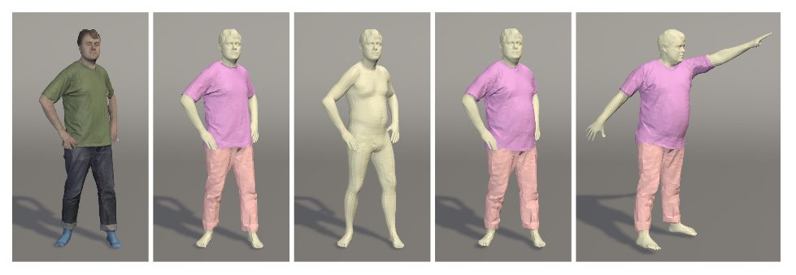

# Clothed People

# Gerard Pons-Moll

### [Siggraph, 2017] [ClothCap: Seamless 4D Clothing Capture and Retargeting](https://ps.is.tuebingen.mpg.de/publications/pons-moll-siggraph2017)  

[视频地址](https://www.youtube.com/watch?v=dVxj8tzx04U) 

>  从左至右：1. 输入的有纹理的体3D点云数据; 2. 使用MRF自动分割衣服; 3.估计minimally clothed shape;4.5. 可以修改人体的shape和ose，衣服也会随之改变

目标：衣服捕捉、建模、重定向、变姿势、虚拟换装

- 问题：如何对人体衣服与人体同时进行建模
- 输入：4D扫描数据
- 输出：人体动作、形状；衣服
- 挑战：高质量的捕捉、分割、表面跟踪、人体形状动作估计
- 方法：使用多网格(multi-mesh)表达。
- 贡献：
  - 一种利用人体模型自动分割扫描数据的方法
  - 一种多网格模板跟踪方法
  - 一种重定向衣服到新的形状的方法
- 数据：60fps的高精度的4D scan
- 步骤：
  0. 设置：定义衣服的数量，以及这些衣服大概会在身体的什么部位
  1. 分割：
     - 输入：4D扫描数据（点）
     - 输出：每一帧的SMPL对齐的结果
     - 输入：
     - 输出：每一帧上每一个点的分割结果
  2. Multi-cloth alignment: 变形分割的衣服模型去拟合分割的扫描数据
  3. 重定向：根据输入的序列估计衣服是怎样根据shape变形的，并简单的应用到新的序列上

详细介绍：

#### 身体模型

基于SMPL模型，可参考之前写的[SMPL模型介绍](SMPL)

输入：$\beta, \theta$ 表示人体形状与姿势

输出：$T$表示人体网格模型所有点的坐标

### 衣服模型

#### 5.1 单一网格配准

问题：

### [ICCV, 2017] [A Generative Model of People in Clothing](http://files.is.tuebingen.mpg.de/classner/gp/)

### [CVPR, 2018] [Video Based Reconstruction of 3D People Models](https://virtualhumans.mpi-inf.mpg.de/papers/alldieck2018video/alldieck2018videoshapes.pdf)

### [CVPR, 2018] [DoubleFusion: Real-time Capture of Human Performance with Inner Body Shape from a Depth Sensor](https://virtualhumans.mpi-inf.mpg.de/papers/DoubleFusion2018/DoubleFusion2018.pdf)

### [3DV, 2018] [Detailed Human Avatars from Monocular Video]()

### [CVPR, 2019] [SimulCap : Single-View Human Performance Capture with Cloth Simulation](https://virtualhumans.mpi-inf.mpg.de/papers/SimulCap19/SimulCap19.pdf)

### [CVPR, 2019] [Learning to Reconstruct People in Clothing from a Single RGB Camera]()

### [3DV, 2019] [360-Degree Textures of People in Clothing from a Single Image]()

### [ICCV, 2019] [Tex2Shape: Detailed Full Human Body Geometry from a Single Image]()

### [ICCV, 2019] [Multi-Garment Net: Learning to Dress 3D People from Images](http://virtualhumans.mpi-inf.mpg.de/papers/bhatnagar2019mgn/bhatnagar2019mgn.pdf) [[code](https://github.com/bharat-b7/MultiGarmentNetwork)]

> Dress SMPL body model with our Digital Wardrobe

论文提出了Multi-Garmetn Network(MGN)

- 问题：从图片中获取一个人的衣服，并将他穿到另一个人身上
- 输入：同一个人的一段视频中的少数帧（1-8帧）
- 输出：使用SMPL表示的人体形状，以及附着在上面的衣服
- 数据：搞了一个数字衣柜（digital wardobe)，包含了712个数字的garments。

- 

